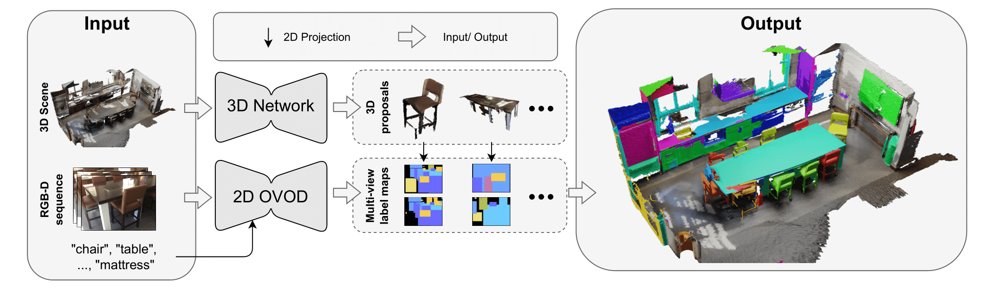
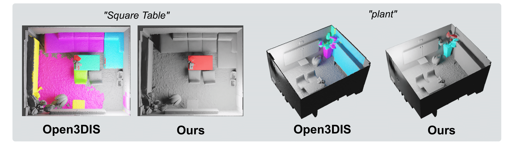

 <div align="center">
 
## Open-YOLO 3D: Towards Fast and Accurate Open-Vocabulary 3D Instance Segmentation
## ICLR 2025 (Oral 📢) 
<div align="center">
    
</div>

</div>

<div align="center">
<a href="">Mohamed El Amine Boudjoghra</a><sup>1</sup>, <a href="">Angela Dai</a><sup>2</sup>, <a href=""> Jean Lahoud</a><sup>1</sup>, <a href="">Hisham Cholakkal</a><sup>1</sup>, <a href="">Rao Muhammad Anwer</a><sup>1,3</sup>,  <a href="">Salman Khan</a><sup>1,4</sup>, <a href="">Fahad Khan</a><sup>1,5</sup>

<sup>1</sup>Mohamed Bin Zayed University of Artificial Intelligence (MBZUAI) <sup>2</sup>Technical University of Munich (TUM) <sup>3</sup>Aalto University <sup>4</sup>Australian National University <sup>5</sup>Linköping University
</div>


<div align="center">
 
<a href='https://arxiv.org/abs/2406.02548' target="_blank"></a> 


 </div>


### News

* **30 May 2024**: [Open-YOLO 3D](https://arxiv.org/abs/2406.02548) released on arXiv. 📝
* **30 May 2024**: Code released. 💻

### Abstract

 Recent works on open-vocabulary 3D instance segmentation show strong promise, but at the cost of slow inference speed and high computation requirements. This high computation cost is typically due to their heavy reliance on 3D clip features, which require computationally expensive 2D foundation models like Segment Anything (SAM) and CLIP for multi-view aggregation into 3D. As a consequence, this hampers their applicability in many real-world applications that require both fast and accurate predictions. To this end, we propose a fast yet accurate open-vocabulary 3D instance segmentation approach, named Open-YOLO 3D, that effectively leverages only 2D object detection from multi-view RGB images for open-vocabulary 3D instance segmentation. 
 We address this task by generating class-agnostic 3D masks for objects in the scene and associating them with text prompts.
 We observe that the projection of class-agnostic 3D point cloud instances already holds instance information; thus, using SAM might only result in redundancy that unnecessarily increases the inference time.
We empirically find that a better performance of matching text prompts to 3D masks can be achieved in a faster fashion with a 2D object detector.  We validate our Open-YOLO 3D on two benchmarks, ScanNet200 and Replica, 
 under two scenarios: (i) with ground truth masks, where labels are required for given object proposals, and (ii) with class-agnostic 3D proposals generated from a 3D proposal network. Our Open-YOLO 3D achieves state-of-the-art performance on both datasets while obtaining up to 16x speedup compared to the best existing method in literature. On ScanNet200 val. set, our Open-YOLO 3D achieves mean average precision (mAP) of 24.7% while operating at 22 seconds per scene.

### Qualitative results
<br>

<div align="center">
    
</div>


## Installation guide

Kindly check [Installation guide](./docs/Installation.md) on how to setup the Conda environment and to download the checkpoints, the pre-computed class agnostic masks, and the ground truth masks.

## Data Preparation

Kindly check [Data Preparation guide](./docs/Data_prep.md) on how to prepare ScanNet200 and Replica datasets.

## Results reproducibility

Kindly use the pre-computed class agnostic masks we shared to reproduce the exact numbers we reported in the paper.

**Reproduce the results of ScanNet200 with precomputed-masks (using Mask3D)**
```
python run_evaluation.py --dataset_name scannet200 --path_to_3d_masks "./output/scannet200/scannet200_masks"
```
**Reproduce the results of ScanNet200 with oracle 3D masks (ground truth 3D masks)**
```
python run_evaluation.py --dataset_name scannet200 --path_to_3d_masks "./output/scannet200/scannet200_ground_truth_masks" --is_gt
```
**Reproduce the results of Replica with precomputed-masks (using Mask3D)**
```
python run_evaluation.py --dataset_name replica --path_to_3d_masks "./output/replica/replica_masks"
```
**Reproduce the results of Replica with oracle 3D masks (ground truth 3D masks)**
```
python run_evaluation.py --dataset_name replica --path_to_3d_masks "./output/replica/replica_ground_truth_masks" --is_gt
```

You can evaluate without our 3D class-agnostic masks, but this may lead to variability in results due to elements like furthest point sampling that cause randomness in predictions from Mask3D. For consistent results with the ones we report in the paper, we recommend using our pre-computed masks. 

**Reproduce the results of Replica or ScanNet200 without using our pre-computed masks**
```
python run_evaluation.py --dataset_name $DATASET_NAME
```

## Single scene inference

```
from utils import OpenYolo3D
import os
import pyviz3d.visualizer as viz
from models.Mask3D.mask3d import load_mesh_or_pc
import numpy as np

# Prediction step
openyolo3d = OpenYolo3D(f"{os.getcwd()}/pretrained/config.yaml")
prediction = openyolo3d.predict(path_2_scene_data=f"{os.getcwd()}/data/replica/office0", depth_scale=6553.5, text = ["chair"]) 
openyolo3d.save_output_as_ply(f"{os.getcwd()}/output.ply") 

# Visualization step
pc = load_mesh_or_pc(f"{os.getcwd()}/output.ply", datatype="point cloud")
point_size = 35.0
v = viz.Visualizer(position=[5, 5, 1])
v.add_points('Prediction', np.asarray(pc.points), np.asarray(pc.colors)*255.0, point_size=point_size, visible=True)

blender_args = {'output_prefix': './',
                  'executable_path': '/Applications/Blender.app/Contents/MacOS/Blender'}
v.save('example_meshes', blender_args=blender_args)
```

## Acknoledgments
We would like to thank the authors of <a href="https://github.com/cvg/Mask3D">Mask3D</a> and <a href="https://github.com/AILab-CVC/YOLO-World">YoloWorld</a> for their works which were used for our model.
</div>

## BibTeX :pray:
```
@inproceedings{
boudjoghra2025openyolo,
title={Open-{YOLO} 3D: Towards Fast and Accurate Open-Vocabulary 3D Instance Segmentation},
author={Mohamed El Amine Boudjoghra and Angela Dai and Jean Lahoud and Hisham Cholakkal and Rao Muhammad Anwer and Salman Khan and Fahad Shahbaz Khan},
booktitle={The Thirteenth International Conference on Learning Representations},
year={2025}
}
}
```

